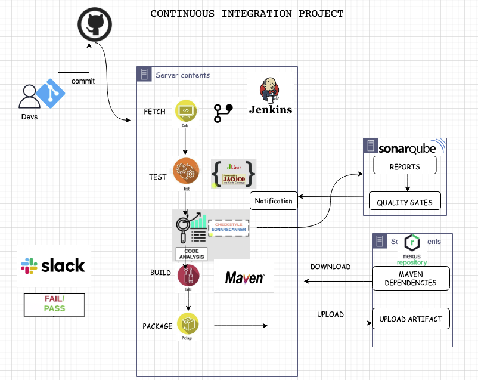
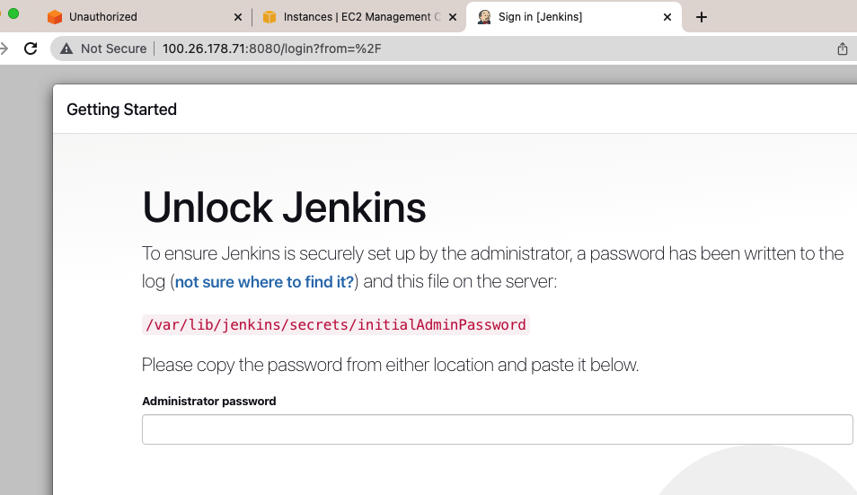

# Continuous Integration of Java App Using Jenkins, Maven, Nexus, Sonarqube and Slack


## Pre-requisities:

 * AWS Account
 * GitHub account
 * Jenkins
 * Maven
 * Nexus
 * SonarQube
 * Slack 
 * Key-Pair



### Step-1: Create Keypair

 - We will need a key-pair while launching our instances. Create a keypair and download the private key to your local system. Make sure to remember where you downloaded the key. We will need this key to SSh our servers throughtout the process.

### Step-2: Create Security Groups for Jenkins, Nexus and SonarQube

* Jenkins SecGrp
```sh
Name: jenkins-SG
Allow: SSH from MyIP
Allow: 8080 from Anywhere IPv4 and IPv6 (We will create a Github webhook which will trigger Jenkins)
```

* Nexus SecGrp
```sh
Name: nexus-SG
Allow: SSH from MyIP
Allow: 8081 from MyIP and Jenkins-SG
```

* SonarQube SecGrp
```sh
Name: sonar-SG
Allow: SSH from MyIP
Allow: 80 from MyIP and Jenkins-SG
```

- Once we created `sonar-SG`, we will add another entry to jenkins Inbound rule as Allow access on 8080 from sonar-SG. SonarQube will send the reports back to Jenkins.

### Step-3: Create EC2 instances for Jenkins, Nexus and SonarQube

#### Jenkins Server Setup

- We will create `Jenkins-server` with below properties and userdata script.
```sh
Name: jenkins-server
AMI: Ubuntu 20.04
SecGrp: jenkins-SG
InstanceType: t2.small
KeyPair: ec2-key
Additional Details: userdata below
```

* Jenkins Userdata script
```sh
#!/bin/bash
sudo apt update
sudo apt install openjdk-11-jdk -y
sudo apt install maven -y
curl -fsSL https://pkg.jenkins.io/debian-stable/jenkins.io.key | sudo tee \
  /usr/share/keyrings/jenkins-keyring.asc > /dev/null
echo deb [signed-by=/usr/share/keyrings/jenkins-keyring.asc] \
  https://pkg.jenkins.io/debian-stable binary/ | sudo tee \
  /etc/apt/sources.list.d/jenkins.list > /dev/null
sudo apt-get update
sudo apt-get install jenkins -y
###
```

#### Nexus Server Setup

- We will create `Nexus-server` with below properties and userdata script.
```sh
Name: nexus-server
AMI: Amazon Linux-2
InstanceType: t2.medium
SecGrp: nexus-SG
KeyPair: ec2-key
Additional Details: userdata below
```

* Nexus Userdata script
```sh
#!/bin/bash
yum install java-1.8.0-openjdk.x86_64 wget -y   
mkdir -p /opt/nexus/   
mkdir -p /tmp/nexus/                           
cd /tmp/nexus/
NEXUSURL="https://download.sonatype.com/nexus/3/latest-unix.tar.gz"
wget $NEXUSURL -O nexus.tar.gz
EXTOUT=`tar xzvf nexus.tar.gz`
NEXUSDIR=`echo $EXTOUT | cut -d '/' -f1`
rm -rf /tmp/nexus/nexus.tar.gz
rsync -avzh /tmp/nexus/ /opt/nexus/
useradd nexus
chown -R nexus.nexus /opt/nexus 
cat <<EOT>> /etc/systemd/system/nexus.service
[Unit]                                                                          
Description=nexus service                                                       
After=network.target                                                            
                                                                  
[Service]                                                                       
Type=forking                                                                    
LimitNOFILE=65536                                                               
ExecStart=/opt/nexus/$NEXUSDIR/bin/nexus start                                  
ExecStop=/opt/nexus/$NEXUSDIR/bin/nexus stop                                    
User=nexus                                                                      
Restart=on-abort                                                                
                                                                  
[Install]                                                                       
WantedBy=multi-user.target                                                      

EOT

echo 'run_as_user="nexus"' > /opt/nexus/$NEXUSDIR/bin/nexus.rc
systemctl daemon-reload
systemctl start nexus
systemctl enable nexus
```

#### SonarQube Server Setup


- We will create `sonar-server` with below properties and userdata script.
```sh
Name: sonar-server
AMI: Ubuntu 18.04
InstanceType: t2.medium
SecGrp: sonar-SG
KeyPair: ec2-key
Additional Details: userdata below
```

* Sonar Userdata script
```sh
#!/bin/bash
cp /etc/sysctl.conf /root/sysctl.conf_backup
cat <<EOT> /etc/sysctl.conf
vm.max_map_count=262144
fs.file-max=65536
ulimit -n 65536
ulimit -u 4096
EOT
cp /etc/security/limits.conf /root/sec_limit.conf_backup
cat <<EOT> /etc/security/limits.conf
sonarqube   -   nofile   65536
sonarqube   -   nproc    409
EOT

sudo apt-get update -y
sudo apt-get install openjdk-11-jdk -y
sudo update-alternatives --config java

java -version

sudo apt update
wget -q https://www.postgresql.org/media/keys/ACCC4CF8.asc -O - | sudo apt-key add -

sudo sh -c 'echo "deb http://apt.postgresql.org/pub/repos/apt/ `lsb_release -cs`-pgdg main" >> /etc/apt/sources.list.d/pgdg.list'
sudo apt install postgresql postgresql-contrib -y
#sudo -u postgres psql -c "SELECT version();"
sudo systemctl enable postgresql.service
sudo systemctl start  postgresql.service
sudo echo "postgres:admin123" | chpasswd
runuser -l postgres -c "createuser sonar"
sudo -i -u postgres psql -c "ALTER USER sonar WITH ENCRYPTED PASSWORD 'admin123';"
sudo -i -u postgres psql -c "CREATE DATABASE sonarqube OWNER sonar;"
sudo -i -u postgres psql -c "GRANT ALL PRIVILEGES ON DATABASE sonarqube to sonar;"
systemctl restart  postgresql
#systemctl status -l   postgresql
netstat -tulpena | grep postgres
sudo mkdir -p /sonarqube/
cd /sonarqube/
sudo curl -O https://binaries.sonarsource.com/Distribution/sonarqube/sonarqube-8.3.0.34182.zip
sudo apt-get install zip -y
sudo unzip -o sonarqube-8.3.0.34182.zip -d /opt/
sudo mv /opt/sonarqube-8.3.0.34182/ /opt/sonarqube
sudo groupadd sonar
sudo useradd -c "SonarQube - User" -d /opt/sonarqube/ -g sonar sonar
sudo chown sonar:sonar /opt/sonarqube/ -R
cp /opt/sonarqube/conf/sonar.properties /root/sonar.properties_backup
cat <<EOT> /opt/sonarqube/conf/sonar.properties
sonar.jdbc.username=sonar
sonar.jdbc.password=admin123
sonar.jdbc.url=jdbc:postgresql://localhost/sonarqube
sonar.web.host=0.0.0.0
sonar.web.port=9000
sonar.web.javaAdditionalOpts=-server
sonar.search.javaOpts=-Xmx512m -Xms512m -XX:+HeapDumpOnOutOfMemoryError
sonar.log.level=INFO
sonar.path.logs=logs
EOT

cat <<EOT> /etc/systemd/system/sonarqube.service
[Unit]
Description=SonarQube service
After=syslog.target network.target

[Service]
Type=forking

ExecStart=/opt/sonarqube/bin/linux-x86-64/sonar.sh start
ExecStop=/opt/sonarqube/bin/linux-x86-64/sonar.sh stop

User=sonar
Group=sonar
Restart=always

LimitNOFILE=65536
LimitNPROC=4096


[Install]
WantedBy=multi-user.target
EOT

systemctl daemon-reload
systemctl enable sonarqube.service
#systemctl start sonarqube.service
#systemctl status -l sonarqube.service
apt-get install nginx -y
rm -rf /etc/nginx/sites-enabled/default
rm -rf /etc/nginx/sites-available/default
cat <<EOT> /etc/nginx/sites-available/sonarqube
server{
    listen      80;
    server_name sonarqube.groophy.in;

    access_log  /var/log/nginx/sonar.access.log;
    error_log   /var/log/nginx/sonar.error.log;

    proxy_buffers 16 64k;
    proxy_buffer_size 128k;

    location / {
        proxy_pass  http://127.0.0.1:9000;
        proxy_next_upstream error timeout invalid_header http_500 http_502 http_503 http_504;
        proxy_redirect off;
              
        proxy_set_header    Host            \$host;
        proxy_set_header    X-Real-IP       \$remote_addr;
        proxy_set_header    X-Forwarded-For \$proxy_add_x_forwarded_for;
        proxy_set_header    X-Forwarded-Proto http;
    }
}
EOT
ln -s /etc/nginx/sites-available/sonarqube /etc/nginx/sites-enabled/sonarqube
systemctl enable nginx.service
#systemctl restart nginx.service
sudo ufw allow 80,9000,9001/tcp

echo "System reboot in 30 sec"
sleep 30
reboot
```


### Step-4: Post Installation Steps

#### For Jenkins Server:

- We need to SSH our jenkins server and check system status for Jenkins. Then we will get initialAdmin password from directory `/var/lib/jenkins/secrets/initialAdminPassword` 
```sh
sudo -i
systemctl status jenkins
cat /var/lib/jenkins/secrets/initialAdminPassword 
```


- Go to browser, `http://<public_ip_of_jenkins_server>:8080`, enter initialAdminPasswrd. We will also install suggested plugins. Then we will create our first admin user.

- We will install below plugins for Jenkins.
```sh
Maven Integration
Github Integration
Nexus Artifact Uploader
SonarQube Scanner
Slack Notification
Build Timestamp
```

#### For Nexus Server:

- We need to SSH our nexus server and check system status for nexus.
```sh
sudo -i
system status nexus
```

- Go to browser, `http://<public_ip_of_nexus_server>:8081` ,click sign-in. Initial password will be located `/opt/nexus/sonatype-work/nexus3/admin.password`
```sh
cat /opt/nexus/sonatype-work/nexus3/admin.password
```

- Username is `admin`, paste password from previous step. Then we need to setup our new password and select `Disable Anonymous Access`.

- We select gear symbol and create repository. This repo will be used to store our release artifacts.

```sh
maven2 hosted
Name: vprofile-release
Version policy: Release
```

- Next we will create a maven2 proxy repository. Maven will store the dependecies in this repository, whenever we need any dependency for our project it will check this proxy repo in Nexus first and download it for project. Proxy repo will download the dependecies from maven2 central repo at first.

```sh
maven2 proxy
Name: vpro-maven-central
remote storage: https://repo1.maven.org/maven2/
```

-  This repo will be used to store our snapshot artifacts. That means any artifact with `-SNAPSHOT` extension will be stored in this repository.

```sh
maven2 hosted
Name: vprofile-snapshot
Version policy: Snapshot
```

- Last repo, will be `maven2 group` type. We will use this repo to group all maven repositories.

```sh
maven2 group
Name: vpro-maven-group
Member repositories: 
 - vpro-maven-central
 - vprofile-release
 - vprofile-snapshot
```
